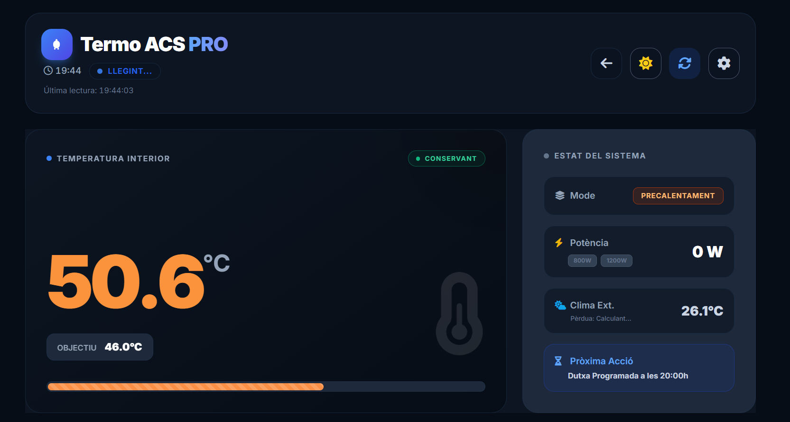
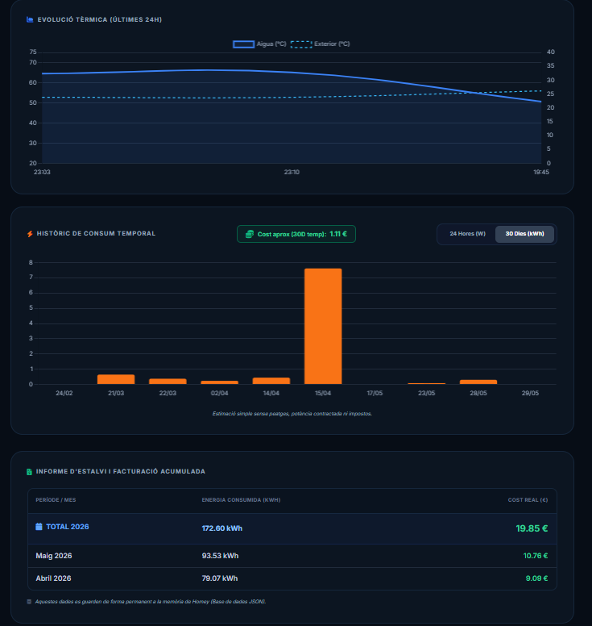
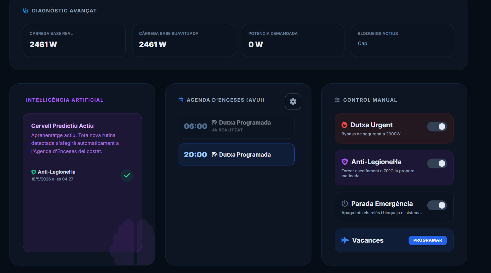

# 🌡️ Termo100 — AI-Driven Smart Water Heater Controller

### Self-Learning Predictive Heating · 3-Gear Load Shedding · Anti-Legionella Automation · PWA Web Dashboard

---

## 🏆 Shelly Smart Home Challenge 2026

| Field | Detail |
|---|---|
| **Category** | 01 · Scripting & Logic (Build the Logic) |
| **Status** | Fully deployed & production-validated |
| **Core Hardware** | Shelly 2PM Gen3 × 2 · Shelly EM · Shelly Plus Add-on + DS18B20 |
| **Core Software** | HomeyScript (Node.js) on Homey Pro Mini · Netlify Serverless PWA |

---

## Table of Contents

1. [The Problem](#1-the-problem)
2. [Hardware Architecture](#2-hardware-architecture)
3. [System Overview](#3-system-overview)
4. [The 3-Gear Smart Load Shedding](#4-the-3-gear-smart-load-shedding)
5. [14 Operating Modes — Priority Chain](#5-14-operating-modes--priority-chain)
6. [Climate-Adaptive Temperature Targets](#6-climate-adaptive-temperature-targets)
7. [Predictive Preheating Engine (ML)](#7-predictive-preheating-engine-ml)
8. [AI Usage Pattern Learning](#8-ai-usage-pattern-learning)
9. [Safety & Fault Systems](#9-safety--fault-systems)
10. [Script Function Reference](#10-script-function-reference)
11. [Configuration Constants](#11-configuration-constants)
12. [Homey Logic Variables — Complete Table](#12-homey-logic-variables--complete-table)
13. [Web Dashboard (termo.html)](#13-web-dashboard-termohtml)
14. [Netlify Serverless Architecture](#14-netlify-serverless-architecture)
15. [Setup Instructions](#15-setup-instructions)
16. [Results](#16-results)

---

## 1. The Problem

Standard 100-litre electric water heaters have zero intelligence. They keep water hot 24/7 at a single fixed temperature. Three concrete pain points drove this project:

| Pain Point | Root Cause | This Project's Solution |
|---|---|---|
| **Cold water mid-shower** | Mid-tank mechanical probe drops 10 °C when cold inlet water rushes in, causing false-satisfied readings and short-cycling | DS18B20 digital probe + predictive just-in-time preheating |
| **Tripped main breaker** | No coordination between the heater and induction/oven loads | Shelly EM live power monitoring + automatic gear downshift |
| **Energy waste off-hours** | Fixed schedule keeps tank at 50 °C at 3 AM | Deep setback + ML-calculated exact start time |
| **Legionella risk** | Thermal disinfection cycles are never done manually | Fully automated 70 °C weekly cycle |

---

## 2. Hardware Architecture

### Shelly 2PM Gen3 — Dual-Element Control (×2 units)

The water heater has **two physically independent heating elements** wired to two separate Shelly 2PM Gen3 devices. This is the foundation of the 3-gear system.

| Device Name in Homey | Element | Nominal Power | Channel |
|---|---|---|---|
| `Shelly 2PM Gen3 800w` | Lower maintenance element | 800 W | Relay CH0 |
| `Shelly 2PM Gen3 1200w` | Upper fast-recovery element | 1 200 W | Relay CH0 |

Each **Shelly 2PM Gen3** provides:
- ⚡ **Individual relay control** — on/off per element independently
- 📊 **Per-channel power metering** — the `measure_power` capability is the heartbeat of the fault-detection system. If a relay is commanded ON but reports < 20 W for 8+ minutes, the script diagnoses a burned-out element, isolates it, and sends a push notification.
- 🌡️ **Temperature probe host** — the Shelly Plus Add-on carrying the DS18B20 is physically attached to the `Shelly 2PM Gen3 1200w`, exposing the tank temperature via `measure_temperature.1`.

### Shelly EM — Whole-House Power Balancing

A **Shelly EM** is installed at the main circuit breaker and monitors total household consumption in real time. The script reads `measure_power` on every 5-minute execution to calculate:

```
baseLoad = totalHousePower − currentHeaterPower
availableCapacity = POWER_LIMIT_SOFT (5 300 W) − baseLoad
```

Before switching any relay on, the algorithm selects the highest heating gear that fits within `availableCapacity`. If the oven or induction hob turns on mid-cycle, the heater automatically downshifts without any human intervention.

### Shelly Plus Add-on + DS18B20 — Digital Temperature Sensing

The factory mechanical thermostat has been **completely bypassed**. A DS18B20 one-wire digital sensor was inserted into the tank's thermal well and wired through a Shelly Plus Add-on docked to the `Shelly 2PM Gen3 1200w`. This provides:
- Decimal-precision readings (±0.5 °C accuracy vs. ±5 °C mechanical)
- 1-second response time vs. several minutes for mechanical probes
- Direct digital readout via `measure_temperature.1` — no analog conversion
- The ability to detect micro-drops of 1.5 °C that signal actual hot-water consumption

### Supporting Devices

| Device | Role |
|---|---|
| **Netatmo Weather Station** (`Sensor netatmo exterior`) | Exterior temperature for climate-adaptive setpoints |
| **Virtual Button** (`Comandament Termo`) | Physical remote trigger for Urgent Shower mode |
| **Virtual Switch** (`Vacances`) | Physical toggle that forces Absence mode on/off |
| **Homey Pro Mini** | Runs the HomeyScript every 5 minutes as an Advanced Flow |

### Architecture Diagram


<details>
<summary>ASCII fallback diagram</summary>

```
┌──────────────────────────────────────────────────────────────┐
│                    MAIN PANEL                                │
│  ┌─────────────┐                                             │
│  │  Shelly EM  │ ──── measure_power ──────────────────────┐  │
│  └─────────────┘       (total house W)                    │  │
└──────────────────────────────────────────────────────────┐ │ │
                                                           │ │ │
              ┌────────────────────────────────────────────▼─▼─▼──┐
              │                  Homey Pro Mini                    │
              │          HomeyScript · every 5 min                 │
              │   ┌─────────────────────────────────────────────┐  │
              │   │  Layer 1: CONFIG  (constants & variables)   │  │
              │   │  Layer 2: ML/HISTORY (predict & learn)      │  │
              │   │  Layer 3: BRAIN (mode & target decision)    │  │
              │   │  Layer 4: ACTUATION (relay & notify)        │  │
              │   └─────────────────────────────────────────────┘  │
              └──────────────┬────────────────┬────────────────────┘
                             │                │
               ┌─────────────▼──────┐  ┌──────▼──────────────┐
               │ Shelly 2PM Gen3    │  │ Shelly 2PM Gen3      │
               │    800W            │  │    1200W             │
               │  + power metering  │  │  + power metering    │
               │                    │  │  + Shelly Plus Add-on│
               │    [800W element]  │  │  + DS18B20 probe     │
               └────────────────────┘  │    [1200W element]   │
                                       └──────────────────────┘
                                               │
                          ┌────────────────────▼────────────────────┐
                          │     Netatmo Outdoor Sensor               │
                          │     (exterior temperature → setpoints)   │
                          └──────────────────────────────────────────┘
```

</details>

---

## 3. System Overview

The HomeyScript (`homeyscript-termo-v7.2.js`) runs as an **idempotent asynchronous routine every 5 minutes** via a Homey Advanced Flow. Each execution is self-contained: it reads all sensor states, evaluates all conditions, takes all necessary actions, and writes back all status variables — with zero side effects if nothing needs to change.

### Execution Flow (per 5-minute tick)

```
1. Device loading          → Shelly 2PM ×2, Shelly EM, Netatmo, optionals
2. Variable loading        → All 25 Homey Logic variables
3. Args processing         → Handle Web UI commands (e.g. delete_ia pattern)
4. Black Box tick          → Log debug snapshot, calculate elapsed time for billing
5. Safe-Mode checks        → CORRUPT_SENSOR → EMERGENCY_STOP → OVERHEATING (early exit)
6. Absence/Holiday logic   → Check vacation dates, sync physical toggle
7. Schedule detection      → Parse JSON schedules, calculate PREHEATING windows
8. ML pattern learning     → Detect consumption drops, update learned routines
9. Anti-Legionella check   → Sunday 03:00–06:00 window, 15-day interval
10. AI Micro-Comfort       → 30-min lookahead for learned routine preheating
11. Relay fault detection  → verifRelay() × 2 → TOTAL_FAILURE check
12. Mode & target final    → Priority chain determines modoActual + targetTemp
13. Hysteresis evaluation  → wantHeat decision with active-mode half-hysteresis
14. 3-Gear load shedding   → Select optimal power tier via Shelly EM baseLoad
15. Anti-short-cycle guard → 5-min minimum OFF time per relay
16. Relay synchronization  → syncRelay() × 2 (only writes if state changed)
17. Variable updates       → Write all status variables (idempotent)
18. Billing accumulator    → Add (power × elapsed_ms) to monthly kWh log
19. Urgent shower timer    → Calculate minutes to 43 °C usable threshold
20. Return JSON payload    → Full state object for Web Dashboard
```

---

## 4. The 3-Gear Smart Load Shedding

Unlike a single-relay smart plug, this system uses **two independent Shelly 2PM Gen3 devices** controlling two separate heating elements. This creates a true 3-gear gearbox with dynamic selection.

### The Gears

| Gear | Elements | Power | Used When |
|---|---|---|---|
| **Gear 1 — Low** | 800 W only | 800 W | Eco maintenance, fine-tuning near target |
| **Gear 2 — Medium** | 1 200 W only | 1 200 W | Standard scheduled preheating |
| **Gear 3 — Full** | 800 W + 1 200 W | 2 000 W | Urgent shower, Anti-Legionella, ΔT ≥ 20 °C, Holiday Return |
| **Off** | Neither | 0 W | Target reached, blocked, emergency |

### Gear Selection Algorithm

```javascript
// 1. Select DESIRED gear based on mode and delta
if (dutxaUrgent || enAntiLegionella || modoActual === 'HOLIDAY_RETURN')  → 2000W
else if (delta >= DELTA_VERY_COLD=20 || enPrecalentament)                → 2000W
else if (delta >= DELTA_COLD=10)                                         → 1200W
else                                                                     →  800W

// 2. DYNAMIC DOWNSHIFT via Shelly EM live reading
if (baseLoad + currentHeaterPower >= POWER_LIMIT_HARD=5600)  → 0W (hard block)
else if (!canAfford(desiredPower)):
    2000W → try 1200W → try 800W → 0W
    1200W → try  800W → 0W
     800W → 0W if still unaffordable

// 3. Fault bypass (avaria800 or avaria1200)
if (avaria800 && desired includes 800W)   → use 1200W instead
if (avaria1200 && desired includes 1200W) → use  800W instead

// 4. Anti-short-cycle (ANTI_SHORT_CYCLE_MIN = 5 min)
if (relay was OFF < 5 min ago) → stay OFF (bypassed for urgent/legionella)
```

### Why Two Shelly 2PM Gen3 Devices?

A single relay can only do ON/OFF. Two independently-metered Shelly 2PM Gen3 relays enable:
1. **3 distinct power tiers** without any external hardware
2. **Per-element fault detection** — if only one element fails, the system continues on the other
3. **Dynamic throttling** down to the watt level based on live grid data
4. **Separate anti-short-cycle timers** per element to prevent compressor-style cycling wear

---

## 5. 14 Operating Modes — Priority Chain

The mode is evaluated top-to-bottom; the first match wins. Lower-priority modes are overridden by higher ones.

| Priority | Mode | Target Temp | Gear Used | Description |
|---|---|---|---|---|
| 1 | **`CORRUPT_SENSOR`** | 0 °C | OFF | DS18B20 returns null, NaN, ≤0 or >110. Both relays killed immediately. Push notification sent. |
| 2 | **`EMERGENCY_STOP`** | 0 °C | OFF | `ParadaEmergencia = true` set from Web UI. Hard lock overrides all schedules and AI. |
| 3 | **`OVERHEATING`** | 0 °C | OFF | Tank temperature ≥ 80 °C. Both relays killed. Critical push notification sent. |
| 4 | **`TOTAL_FAILURE`** | 0 °C | OFF | Both `Termo_Avaria_800W` and `Termo_Avaria_1200W` are true. System halted. |
| 5 | **`HOLIDAY`** | 15 °C | Gear 1/2 | Within vacation departure→(return − preheat) window. Antifreeze protection only. |
| 6 | **`HOLIDAY_RETURN`** | 70 °C | Gear 3 | Pre-return window: heats to 70 °C (simultaneous Legionella sanitization). |
| 7 | **`ABSENCE`** | 15 °C | Gear 1/2 | `ModoAusencia = true` (manual or via physical Vacances switch). Antifreeze. |
| 8 | **`ANTI_LEGIONELLA`** | 70 °C | Gear 3 | Sunday 03:00–06:00, if >15 days since last cycle. Forces 70 °C thermal disinfection. |
| 9 | **`URGENT_SHOWER`** | 65 °C | Gear 3 | `DutxaUrgent = true`. Bypasses all schedules, forces 2000 W. Countdown timer active. |
| 10 | **`PREHEATING`** | Comfort°C | Gear 3 | ML-calculated window before a scheduled comfort slot. Heats to comfort target. |
| 11 | **`COMFORT`** | Comfort°C | Gear 1/2 | Active scheduled comfort window. Maintains climate-adapted target. |
| 12 | **`AI_MICRO_COMFORT`** | 45 °C | Gear 1/2 | A learned usage routine starts in ~30 min. Gentle proactive heating to 45 °C. |
| 13 | **`BASE_RECOVERY`** | Base°C | Gear 1/2 | Tank fell below minimum threshold. Recovers to base temperature. |
| 14 | **`ECO`** | Base°C | Gear 1 | Default deep-setback mode. Maintains only climate-adapted base temperature. |

### Mode-to-Hysteresis Mapping

| Mode Group | Hysteresis Applied |
|---|---|
| COMFORT, PREHEATING, AI_MICRO_COMFORT (active modes) | `HYSTERESIS_CONFORT / 2 = 1 °C` |
| COMFORT, PREHEATING windows (standard) | `HYSTERESIS_CONFORT = 2 °C` |
| ECO, BASE_RECOVERY, ABSENCE, HOLIDAY | `HYSTERESIS_ECO = 5 °C` |

The narrowed ±1 °C hysteresis in active modes ensures the tank actually reaches and holds the target temperature during scheduled windows.

---

## 6. Climate-Adaptive Temperature Targets

The script reads the Netatmo outdoor sensor on every tick. Target temperatures shift automatically based on the season, so the heater never works harder than the weather demands.

| Season | Outdoor Trigger | Base Temp | Comfort Temp | Minimum Temp |
|---|---|---|---|---|
| 🥶 **Winter** | T_ext ≤ 12 °C | 38 °C | **54 °C** | 32 °C |
| 🌤️ **Mid-season** | 12 °C < T_ext ≤ 22 °C | 35 °C | **51 °C** | 28 °C |
| ☀️ **Summer** | T_ext > 22 °C | 30 °C | **46 °C** | 25 °C |

`calculaConsignes(T_ext)` returns the correct triplet `{ T_base, T_confort, T_min }` for use throughout the logic.

In summer, incoming mains water is already ~20 °C warmer, so the heater runs significantly less. The system automatically captures this without any manual seasonal reconfiguration.

---

## 7. Predictive Preheating Engine (ML)

Instead of turning on at a fixed time, the system **calculates the exact start time** needed to reach the comfort temperature by the scheduled moment.

### How It Works

For each scheduled comfort window, the algorithm:

1. Calls `calcularTempsCalentament(vars, currentTemp, currentTempExt, power)`.
2. Queries the last 50 recorded heating cycles (`Termo_Historic_JSON`) for entries where:
   - `|record.tempInicio − currentTemp| ≤ 5 °C`
   - `|record.tempExt − currentTempExt| ≤ 5 °C`
   - `record.potencia === requestedPower`
3. If **≥ 5 matching records** found: computes a **recency-weighted average** (more recent cycles weighted higher) and applies a **+10% safety margin**:
   ```
   preheatMinutes = ceil(weightedAverage(matchingCycles.minutosReales) × 1.1)
   ```
4. If **< 5 records** (e.g. first week of a new season): falls back to `MINUTS_FALLBACK = 90 minutes` — a conservative thermodynamic estimate.

The preheating window opens exactly `preheatMinutes` before the scheduled comfort start. The water hits the target temperature precisely when it is needed — no earlier (wasted standing heat) and no later (cold shower).

### Cycle Recording — `gravarCicle()`

At the end of each heating cycle (when `wantHeat` transitions from `true` to `false`), the script records:

```json
{
  "fecha": "2026-05-29T06:42:00.000Z",
  "tempInicio": 31.4,
  "tempExt": 18.2,
  "potencia": 2000,
  "minutosReales": 74
}
```

The rolling buffer keeps the **last 50 cycles**. Older entries are discarded automatically. Over time, the predictions become more accurate and better calibrated to the actual thermal behaviour of the specific tank, installation, and climate.

### Vacation Pre-Return Heating

For the `HOLIDAY_RETURN` mode, the algorithm uses:
```
minutsPreheatVac = calcularTempsCalentament(..., 2000) × 1.5
```
The extra 50% margin accounts for the tank starting from antifreeze temperature (15 °C), a much larger delta than a normal preheat.

---

## 8. AI Usage Pattern Learning

The system continuously monitors the DS18B20 probe and builds a model of the family's actual hot-water usage habits — without any manual schedule entry.

### Detection Logic (every 5-minute tick)

```
lastTemp = Termo_Last_Temp  (saved from previous tick)
drop = lastTemp − currentTemp

if (drop >= CAIGUDA_GRAUS_CONSUM=1.5 °C)
    AND (no relay was ON — passive cooling filtered out)
    AND (current hour is NOT inside any programmed schedule)
THEN → log this timestamp as a usage event
```

Only drops ≥ 1.5 °C are logged. The DS18B20's precision makes it possible to reliably distinguish actual hot-water draw from passive thermal loss (~0.1–0.2 °C / 5 min).

### Pattern Consolidation

Events are stored in `Termo_Patrons_USO` (a JSON object with `hist[]` and `rutines[]`). Every tick:

1. Events older than **7 days** are purged.
2. For each hour of the day (0–23), the number of **distinct days** with a logged event is counted.
3. If an hour accumulates events on **≥ 3 distinct days** (`MIN_DIES_PATRO`), it graduates to a `rutines[]` entry — a learned routine.
4. Learned routines trigger the `AI_MICRO_COMFORT` mode: if a routine hour is within the **next 30 minutes**, the system begins gentle preheating to 45 °C proactively.

### Pattern Deletion via Web UI

The Web Dashboard can send a `delete_ia` command with a specific hour to the script via its `args` parameter. The script removes that hour from both `hist[]` and `rutines[]` atomically.

---

## 9. Safety & Fault Systems

### 9.1 Probe Corruption Guard

Every execution starts by validating the DS18B20 reading:
```javascript
if (tempTermoRaw === null || isNaN(tempTermoRaw) || tempTermoRaw <= 0 || tempTermoRaw > 110)
    → CORRUPT_SENSOR mode, both relays OFF, push notification
```
This prevents a disconnected sensor from causing runaway heating.

### 9.2 Critical Overheat (≥ 80 °C)

```javascript
if (tempTermo >= TEMP_MAX_SEGURETAT=80)
    → OVERHEATING mode, both relays OFF
    → sendNotification("🔥 MAXIMUM ALERT: Water reached Xº C...")
```

### 9.3 Relay Fault Detection — `verifRelay()`

For each heating element, the script tracks how long the relay has been commanded ON (`Termo_R800W_EncesaDes` / `Termo_R1200W_EncesaDes`). If the Shelly 2PM reports **< 20 W** for **≥ 8 continuous minutes** while the relay is ON:

```
→ Set Termo_Avaria_800W / Termo_Avaria_1200W = true
→ Force relay OFF
→ sendNotification("⚠️ Malfunction detected in 800W/1200W element...")
```

The system then continues running on the remaining healthy element. If **both** elements fault simultaneously, `TOTAL_FAILURE` mode is triggered and a final notification is sent.

### 9.4 Anti-Short-Cycle Protection

Every relay maintains a `Termo_R800W_UltimApagat` / `Termo_R1200W_UltimApagat` timestamp. A relay cannot be turned back ON until `ANTI_SHORT_CYCLE_MIN = 5 minutes` have elapsed since its last OFF. This protection is automatically bypassed for `URGENT_SHOWER`, `ANTI_LEGIONELLA`, and `HOLIDAY_RETURN` modes.

### 9.5 Emergency Stop (Web UI Hard Lock)

Setting `ParadaEmergencia = true` (via the red toggle on the Web Dashboard) immediately kills both relays and locks the system into `EMERGENCY_STOP`. No AI routine, no schedule, no urgent shower request can override this flag while it is active.

### 9.6 Anti-Legionella Automation

The system automatically runs a 70 °C thermal disinfection cycle:
- **Trigger window:** Sunday, 03:00–06:00 local time
- **Interval guard:** only if `UltimCicleLegionella` is empty or > 15 days ago
- **Completion:** when temperature reaches 70 °C − hysteresis, the ISO timestamp is written to `UltimCicleLegionella`
- **Force trigger:** set `LegionellaForcada = true` from the Web Dashboard; runs at the next Sunday dawn

---

## 10. Script Function Reference

### Utility Functions

| Function | Signature | Description |
|---|---|---|
| `getTimezoneOffset()` | `() → Number` | Dynamically calculates CET (+60 min) or CEST (+120 min) offset based on European DST rules (last Sunday of March / October). No external library needed. |
| `log(msg)` | `(String) → void` | Conditional `console.log` wrapper. All output is prefixed `[THERMO v7.2]`. Controlled by `ENABLE_LOGS` constant. |
| `toMinutes(h, m)` | `(Number, Number) → Number` | Converts hours + minutes to total minutes from midnight (e.g. `toMinutes(14, 30) → 870`). Used throughout schedule comparisons. |
| `getCurrentTime()` | `() → Date` | Returns a `Date` object adjusted for the local timezone offset via `getTimezoneOffset()`. This is the canonical "now" used across the entire script. |
| `formatDate(date)` | `(Date) → String` | Returns `YYYY-MM-DD HH:MM` formatted string. Used for writing timestamps to Homey variables and debug logs. |
| `isNowBetween(sH, sM, eH, eM, now)` | `(Number×4, Date) → Boolean` | Range check on `now` against a [start, end) window defined by hours+minutes. Correctly handles **midnight crossover** (e.g. 23:00–01:00). |
| `isNowBetweenMins(nowMin, startMin, endMin)` | `(Number×3) → Boolean` | Same logic as `isNowBetween` but operates entirely in minute integers. Used in schedule-window inner loops for performance. |
| `calculaConsignes(T_ext)` | `(Number) → {T_base, T_confort, T_min}` | Lookup-table function that returns the three climate-adapted temperature targets based on the current exterior temperature. |

### Homey Interface Functions

| Function | Signature | Description |
|---|---|---|
| `updateLogicIfChanged(varObj, newValue)` | `(Object, any) → Promise<Boolean>` | Writes a Homey Logic variable **only if** the new value differs from the current one. Eliminates redundant API calls. Returns `true` if the write was performed. |
| `getVariable(vars, name, required)` | `(Object, String, Boolean) → Object` | Finds a Homey Logic variable by name from the pre-loaded `vars` map. If `required=true` (default) and the variable is not found, throws an error with the variable name. |
| `forceRelayState(dev, desiredOn)` | `(Device, Boolean) → Promise<Boolean>` | Sets the `onoff` capability of a Shelly device. Returns `true` on success, `false` on error (non-throwing). |
| `sendNotification(msg)` | `(String) → Promise<void>` | Sends a Homey push notification prefixed with `🌡️ Thermo:`. Controlled by `ENABLE_NOTIFICATIONS` constant. Swallows errors silently so notification failures never abort the main logic. |

### Data & ML Functions

| Function | Signature | Description |
|---|---|---|
| `llegirHistoric(vars)` | `(Object) → Promise<{registros[]}>` | Reads and JSON-parses the `Termo_Historic_JSON` variable. Returns `{ registros: [] }` as a safe default if the variable is absent, empty, or malformed. |
| `calcularTempsCalentament(vars, tempActual, tempExt, potencia)` | `(Object, Number, Number, Number) → Promise<Number>` | Core ML prediction engine. Queries the last-50-cycle history for similar starting conditions (±5 °C water temp, ±5 °C exterior, same power). If ≥ 5 matches: returns recency-weighted average × 1.1. Otherwise returns `MINUTS_FALLBACK = 90`. |
| `gravarCicle(vars, tempInicio, tempExt, potencia, minutosReales)` | `(Object, Number, Number, Number, Number) → Promise<void>` | Appends a completed heating cycle record to `Termo_Historic_JSON`. Ignores cycles shorter than 2 minutes (noise). Trims the buffer to the last 50 entries. Records: ISO date, start temp (1 decimal), exterior temp (1 decimal), power tier, actual duration. |

### Main Entry Point

| Function | Signature | Description |
|---|---|---|
| `main()` | `() → Promise<Object>` | Top-level async function. Orchestrates all 20 execution steps (device loading → billing accumulation → return payload). Returns a full JSON state object consumed by the Web Dashboard. |

### Inner Functions (defined inside `main()`)

| Function | Signature | Description |
|---|---|---|
| `fallbackResponse(safeModeName, currentTemp)` | `(String, Number) → Object` | Generates a safe "all-off" response object for early-exit safe-mode returns (CORRUPT_SENSOR, EMERGENCY_STOP, OVERHEATING, TOTAL_FAILURE). All relays OFF, zero consumption. |
| `verifRelay(varEncesa, pwr, isRelayOn, isAvaria, varAvaria, devObj, nomResist)` | `(vars…) → Promise<Boolean>` | Relay fault detector. Tracks ON-time via `Termo_RxxxW_EncesaDes`. If relay reports < 20 W for ≥ `MINUTS_FALLO_CONFIRMAT=8` minutes, declares fault, cuts power, notifies user. Returns updated `isAvaria` state. |
| `syncRelay(dev, desiredOn, isCurrentlyOn, varEncesa, varApagat)` | `(vars…) → Promise<void>` | Relay state synchronizer. Only calls `forceRelayState` if a state change is needed. Maintains `EncesaDes` (ON-since timestamp) and `UltimApagat` (last-OFF timestamp) variables for fault detection and short-cycle protection. |

### Return Payload Structure

```json
{
  "tempAgua": 48.3,
  "tempObjectiu": 51.0,
  "tempExterior": 18.5,
  "mode": "PREHEATING",
  "rutinesAprenentatge": false,
  "consumActual": 2000,
  "resistencia800": { "on": true },
  "resistencia1200": { "on": true },
  "diagnostics": {
    "potencia_calculada_demandada": 2000,
    "bloqueig_per_consum_massa_alt": false,
    "bloqueig_per_temporitzador_5min": false
  },
  "horaris": [ { "h": 6, "m": 0, "dies": [1,2,3,4,5] } ],
  "rutinesIA": [8, 14],
  "vacances": { "inici": null, "fi": null },
  "minutsRestantsUrgent": null
}
```

---

## 11. Configuration Constants

All threshold values are named constants at the top of the script. Adapting the system to a different tank size, circuit limit, or timezone requires changing only these values.

### Global Flags

| Constant | Default | Description |
|---|---|---|
| `ENABLE_LOGS` | `true` | Enable/disable `console.log` output in Homey Script logs |
| `ENABLE_NOTIFICATIONS` | `true` | Enable/disable push notifications to Homey mobile app |
| `TIMEZONE_NAME` | `'Europe/Madrid'` | Reference label (actual offset calculated dynamically) |

### Device Names

| Constant | Default Value | Maps To |
|---|---|---|
| `DEVICE_800W_NAME` | `'Shelly 2PM Gen3 800w'` | Shelly 2PM controlling 800W element |
| `DEVICE_1200W_NAME` | `'Shelly 2PM Gen3 1200w'` | Shelly 2PM controlling 1200W element + DS18B20 |
| `DEVICE_SHELLY_EM_NAME` | `'1 - Consum total'` | Shelly EM channel for whole-house power |
| `DEVICE_NETATMO_NAME` | `'Sensor netatmo exterior'` | Netatmo outdoor temperature sensor |
| `DEVICE_VIRTUAL_REMOTE` | `'Comandament Termo'` | Optional physical remote for Urgent Shower |
| `DEVICE_VACANCES` | `'Vacances'` | Optional physical switch for Absence mode |

### Climate Thresholds

| Constant | Value | Description |
|---|---|---|
| `TEMP_EXT_FRED` | 12 °C | Below this: Winter profile active |
| `TEMP_EXT_MITJA` | 22 °C | Above this: Summer profile active |

### Temperature Targets

| Constant | Value | Season / Use |
|---|---|---|
| `TEMP_BASE_FRED` | 38 °C | Winter ECO base (deep setback) |
| `TEMP_CONFORT_FRED` | 54 °C | Winter comfort target |
| `TEMP_MIN_FRED` | 32 °C | Winter minimum (triggers BASE_RECOVERY) |
| `TEMP_BASE_MITJA` | 35 °C | Mid-season ECO base |
| `TEMP_CONFORT_MITJA` | 51 °C | Mid-season comfort target |
| `TEMP_MIN_MITJA` | 28 °C | Mid-season minimum |
| `TEMP_BASE_CALOR` | 30 °C | Summer ECO base |
| `TEMP_CONFORT_CALOR` | 46 °C | Summer comfort target |
| `TEMP_MIN_CALOR` | 25 °C | Summer minimum |
| `TEMP_DUTXA_URGENT` | 65 °C | Urgent Shower target |
| `TEMP_MIN_DUTXA_USABLE` | 43 °C | Countdown timer threshold: shower is usable |
| `TEMP_ANTILEGIONELLA` | 70 °C | Anti-Legionella disinfection target |
| `TEMP_MAX_SEGURETAT` | 80 °C | Safety cutoff: triggers OVERHEATING mode |
| `TEMP_ANTIGEL` | 15 °C | Antifreeze target (ABSENCE / HOLIDAY) |
| `TEMP_MICRO_CONFORT` | 45 °C | AI_MICRO_COMFORT gentle pre-warm target |

### Hysteresis & Delta Thresholds

| Constant | Value | Description |
|---|---|---|
| `HYSTERESIS_CONFORT` | 2 °C | Deadband in COMFORT / PREHEATING modes |
| `HYSTERESIS_ECO` | 5 °C | Deadband in ECO / ABSENCE / HOLIDAY |
| `DELTA_VERY_COLD` | 20 °C | ΔT above this → Gear 3 (2000 W) |
| `DELTA_COLD` | 10 °C | ΔT above this → Gear 2 (1200 W) |
| `CAIGUDA_GRAUS_CONSUM` | 1.5 °C | Min drop to count as a consumption event |

### Timing & Protection

| Constant | Value | Description |
|---|---|---|
| `DURADA_FINESTRA_CONFORT_MIN` | 120 min | Duration of each comfort window |
| `MAX_TIME_RESISTENCIA_MIN` | 180 min | Max continuous ON time (watchdog) |
| `ANTI_SHORT_CYCLE_MIN` | 5 min | Minimum OFF time before relay can re-engage |
| `MINUTS_FALLO_CONFIRMAT` | 8 min | Time at <20W before fault is confirmed |
| `MIN_REGISTRES_PREDICCIO` | 5 | Min matching cycles for ML prediction |
| `MINUTS_FALLBACK` | 90 min | Fallback preheat when ML has insufficient data |
| `MIN_DIES_PATRO` | 3 days | Distinct days required to elevate to learned routine |

### Power Limits (from Shelly EM)

| Constant | Value | Description |
|---|---|---|
| `POWER_LIMIT_SOFT` | 5 300 W | Soft ceiling: triggers gear downshift |
| `POWER_LIMIT_HARD` | 5 600 W | Hard ceiling: triggers full heater cutoff |

---

## 12. Homey Logic Variables — Complete Table

Create all of these in **Homey → Logic** before deploying the script. The script will throw a descriptive error naming any missing required variable.

### Number Variables

| Variable Name | R/W | Description |
|---|---|---|
| `TempTermo` | W | Current water temperature (°C, 1 decimal). Updated every tick by the script. Displayed on Web Dashboard. |
| `TempObjectiu` | W | Current target temperature (°C). Set by the brain layer based on active mode. |
| `ConsumoTermo` | W | Current heater power draw (W). Sum of active elements: 0 / 800 / 1200 / 2000. |
| `ConsumoTotal` | W | Total house power from Shelly EM (W, integer). |
| `TempExterior` | W | Exterior temperature from Netatmo (°C, 1 decimal). |
| `Termo_TempInici_Cicle` | R/W | Water temperature at the start of the current heating cycle. Set when heating begins, cleared (0) when cycle ends. Used as input to `gravarCicle()`. |
| `Termo_Last_Temp` | R/W | Water temperature reading from the previous 5-minute tick. Compared against current reading to detect consumption drops for ML learning. |
| `Termo_R800W_UltimApagat` | R/W | Unix timestamp (ms) of when the 800W relay was last turned OFF. Enforces `ANTI_SHORT_CYCLE_MIN`. |
| `Termo_R1200W_UltimApagat` | R/W | Unix timestamp (ms) of when the 1200W relay was last turned OFF. Enforces `ANTI_SHORT_CYCLE_MIN`. |

### Boolean Variables

| Variable Name | R/W | Description |
|---|---|---|
| `DutxaUrgent` | R/W | `true` = Urgent Shower mode active. Written by Web Dashboard toggle and physical remote. Cleared automatically when target reached. |
| `ParadaEmergencia` | R/W | `true` = Emergency Stop hard lock. Written by Web Dashboard. Overrides everything. |
| `ModoAusencia` | R/W | `true` = Absence mode. Written by Web Dashboard, physical Vacances switch, and Holidays logic. |
| `Termo_Avaria_800W` | R/W | `true` = 800W element fault confirmed. Set by `verifRelay()`. Cleared automatically when relay turns off. |
| `Termo_Avaria_1200W` | R/W | `true` = 1200W element fault confirmed. Set by `verifRelay()`. Cleared automatically when relay turns off. |
| `AlertaTermo` | R/W | General alert flag. Used by Web Dashboard alarm panel to show alert banners. |

### String Variables

| Variable Name | R/W | Description |
|---|---|---|
| `ModeTermo` | W | Current operating mode string (e.g. `'COMFORT'`, `'ECO'`, `'URGENT_SHOWER'`). Written every tick. Read by Web Dashboard and Homey Flows. |
| `UltimCicleLegionella` | R/W | ISO 8601 timestamp of the last completed Anti-Legionella cycle. Empty string = never run. Used to enforce the 15-day interval. |
| `Termo_R800W_EncesaDes` | R/W | Formatted timestamp (`YYYY-MM-DD HH:MM`) when the 800W relay was last turned ON. Empty string = relay is OFF. Used by fault detection to measure continuous ON duration. |
| `Termo_R1200W_EncesaDes` | R/W | Same as above for the 1200W relay. |
| `Termo_Historic_JSON` | R/W | JSON string: `{ "registros": [ {fecha, tempInicio, tempExt, potencia, minutosReales}, … ] }`. Rolling buffer of last 50 heating cycles. Core ML dataset for `calcularTempsCalentament()`. |
| `Termo_Patrons_USO` | R/W | JSON string: `{ "hist": [timestamp, …], "rutines": [hour, …] }`. Usage event log and consolidated learned routines for AI habit detection. |
| `Termo_Log_Consumo` | R/W | JSON string: `{ "YYYY-MM": kWh, "YYYY-MM": kWh, …, "Anual_YYYY": kWh }`. Cumulative energy log per month and year. Powers the billing table on the Web Dashboard. |
| `Termo_Horaris_JSON` | R/W | JSON string: `[ { "h": 6, "m": 0, "dies": [1,2,3,4,5] }, … ]`. Active heating schedule. Written by Web Dashboard Schedule Manager. Read by script every tick. |
| `Termo_Vacances_JSON` | R/W | JSON string: `{ "inici": "ISO datetime", "fi": "ISO datetime" }`. Active holiday window. Written by Web Dashboard Holidays modal. Cleared automatically when return date passes. |
| `Termo_Debug_Log` | R/W | JSON string: array of last 60 execution snapshots (time, timestamp, raw temp, relay states, watt readings). Used for the Black Box billing accumulator and diagnostic inspection. |

---

## 13. Web Dashboard (termo.html)

A single-file Progressive Web App (PWA) deployable to Netlify. Built with Tailwind CSS, Chart.js, and Font Awesome. No build step, no framework, zero runtime dependencies beyond CDN.

### PWA Features
- **Installable** on iOS/Android via browser "Add to Home Screen" — manifest embedded inline
- **Dark / Light theme** toggle with `localStorage` persistence
- **10-second polling** via `setInterval(loadAllData, 10000)` for near-realtime updates

### Layout Sections

#### Header
- App title **"Thermo ACS PRO"**
- Live digital clock (HH:MM, updates every second)
- Connection status indicator (Initializing → Reading → Connected / Error)
- Theme toggle, manual Refresh, and Configuration buttons

#### Alarm Panel
Appears automatically above the main grid when any of the following conditions are true:

| Condition | Display |
|---|---|
| `Termo_Avaria_800W` AND `Termo_Avaria_1200W` | 🔴 **TOTAL FAILURE** — both elements dead |
| `Termo_Avaria_800W` OR `Termo_Avaria_1200W` | 🟠 **ELEMENT FAULT** — running on one element |
| `watchdogAlert` in payload | 🔴 **STAGNANT HEATING** — temp not rising despite ON |
| Mode is EMERGENCY_STOP / OVERHEATING / CORRUPT_SENSOR | 🔴 Critical mode displayed |

#### Main Thermostat Card (2/3 width)
- **Giant temperature readout** in °C (1 decimal)
- **Target temperature** pill badge
- **Progress bar** (proportional between min and comfort target)
- **Delta indicator** badge: `HEATING` (orange) / `STANDBY` (blue) / `CONSERVING` (green)
- **Background glow** effect shifts color based on state

#### System Status Card (1/3 width)
- **Current Mode** label (uppercase formatted)
- **Power** row: consumption in W + two LED badges for **800W** and **1200W** relay states
  - LED badge glows orange when relay is ON, grey when OFF
- **Ext. Climate** — exterior temperature + passive cooling rate (`Loss: X.X °C/h`) calculated from DS18B20 drop over consecutive idle ticks
- **Next Action** — upcoming schedule event or "No more today"

#### Advanced Diagnostics Section

| Field | Source | Description |
|---|---|---|
| Raw Base Load | `data.diagnostics.base_load_raw` | Instantaneous household consumption minus active heater draw (from Shelly EM), used for real-time gear selection |
| Smoothed Base Load | `data.diagnostics.base_load_avg` | Rolling-average base load; dampens momentary appliance spikes from affecting gear decisions |
| Demanded Power | `data.diagnostics.potencia_calculada_demandada` | Power tier the algorithm selected before constraint checks (may differ from actual if blocked) |
| Active Blocks | `data.diagnostics.bloqueig_per_consum_massa_alt` / `bloqueig_per_temporitzador_5min` | "Load" badge = Shelly EM forced a gear downshift; "5 min" badge = anti-short-cycle timer prevented re-engagement |

#### AI & Schedule Row (3-column grid)

**Artificial Intelligence card:**
- Shows `Predictive Brain Active` status
- Lists currently active learned routine hours
- Anti-Legionella last cycle date with days-since counter

**Heating Schedule card:**
- Today's active schedule entries with times and days
- Gear icon opens the **Schedule Manager modal**

**Manual Control card:**

| Control | Variable Written | Behavior |
|---|---|---|
| 🔴 **Urgent Shower** toggle | `DutxaUrgent` | Engages Gear 3 (2000W) immediately to 65 °C. Live countdown timer shows minutes to 43 °C (usable). Shows "Shower ready! 🚿" when threshold reached. |
| 🟣 **Anti-Legionella** toggle | `LegionellaForcada` | Forces a 70 °C disinfection cycle at the next Sunday dawn window. |
| 🔴 **Emergency Stop** toggle | `ParadaEmergencia` | Confirmation dialog → hard kills both Shelly relays. Overrides all logic. |
| ✈️ **Holidays** button | Opens vacation modal | Set departure + return datetimes → writes `Termo_Vacances_JSON`. Cancel button clears it. |

#### Charts Section

**Thermal Evolution (Last 24H)** — `tempChart` (Chart.js line)
- Two datasets: Water temperature (°C) — blue line with fill, Exterior temperature (°C) — sky blue
- Y-axis: 20–75 °C
- Data stored in `localStorage` (`tempHistory_v3`) for persistence across page reloads
- Sampled every 5 minutes; older than 24h auto-pruned

**Temporal Consumption** — switchable view:
- **24H Power Demand** (`powerChart24h`) — stepped orange line showing exact moments the 800W or 1200W relays activated
- **30-Day Energy (kWh)** (`powerChart30d`) — bar chart of daily consumption
- Estimated 30-day cost displayed when 30D view is active (`PRICE_PER_KWH = 0.115 €/kWh`)
- Both datasets stored in `localStorage` (`powerHistory_v3`, `energyHistory_v3`)

#### Savings & Billing Report Table
- Reads `Termo_Log_Consumo` from Homey variables
- Displays monthly energy (kWh) and cost (€) per period
- Most recent month shown first
- Annual totals (`Anual_YYYY` keys) displayed separately

### Modals

| Modal | Trigger | Function |
|---|---|---|
| **Configuration** | Gear button in header | Set HomeyScript name + security PIN. Saved to `localStorage`. |
| **Schedule Manager** | Gear icon on Schedule card | Add / edit / delete heating schedule entries. Each entry: time (HH:MM) + days of week checkboxes. Saves to `Termo_Horaris_JSON`. |
| **Holidays** | SCHEDULE button | Date/time pickers for departure and return. Activates antifreeze + pre-return heating. |

### Security
All API calls include the PIN stored in `localStorage`. The Netlify serverless function validates the PIN before proxying to Homey. If no PIN is configured on first load, the Configuration modal appears automatically.

---

## 14. Netlify Serverless Architecture

The dashboard communicates exclusively through a **single Netlify Function endpoint**: `/.netlify/functions/homey`. This serverless proxy:

1. **Validates the PIN** from the request payload
2. **Routes actions** to the Homey Cloud API:
   - `status` → runs the HomeyScript and returns both the script result + all Homey Logic variables
   - `setVariable` → writes a single Homey Logic variable by name+value
3. **Returns JSON** with a standard `{ ok, script, vars }` envelope

### Why This Architecture?

| Benefit | Detail |
|---|---|
| **No CORS issues** | Browser → Netlify (same origin) → Homey Cloud (server-to-server) |
| **PIN never exposed** | PIN travels HTTPS to Netlify; Netlify holds the Homey Bearer token server-side |
| **Zero infrastructure** | Netlify Functions are free-tier serverless, no server to maintain |
| **Single file deploy** | `termo.html` is the entire frontend; drag-and-drop to Netlify |

### Action Payloads

```javascript
// Read status
{ action: 'status', scriptName: 'Thermo_Controller_V7.js', pin: '2026' }

// Update a variable
{ action: 'setVariable', name: 'DutxaUrgent', value: true, pin: '2026' }

// Pass a command argument to the script (e.g. delete AI pattern)
{ action: 'runScript', args: [JSON.stringify({ action: 'delete_ia', hour: 8 })], pin: '2026' }
```

---

## 15. Setup Instructions

### Prerequisites

| Hardware | Purpose |
|---|---|
| **Homey Pro / Homey Pro Mini** | Script execution platform |
| **Shelly 2PM Gen3** (×2) | Dual-element relay control + power metering |
| **Shelly Plus Add-on + DS18B20** | Digital temperature probe (replaces factory mechanical thermostat) |
| **Shelly EM** | Whole-house consumption monitoring at main breaker |
| **Netatmo Weather Station** (or any outdoor temp sensor) | Exterior temperature for climate-adaptive logic |
| **Netlify account** | Free-tier serverless hosting for the Web Dashboard |

### Step 1: Electrical Installation

> ⚠️ **WARNING:** Work on the water heater electrical system must be done by a qualified electrician with power fully disconnected.

1. Open the water heater's electrical compartment.
2. Wire the **800W element** terminals to **Shelly 2PM Gen3 #1** output channel.
3. Wire the **1200W element** terminals to **Shelly 2PM Gen3 #2** output channel.
4. Bypass the factory mechanical thermostat — both Shelly devices receive mains directly.
5. Dock the **Shelly Plus Add-on** onto **Shelly 2PM Gen3 #2**.
6. Insert the **DS18B20 probe** into the tank's existing thermal well and connect to the Add-on's sensor port.
7. Install **Shelly EM** at the main distribution board, current transformer around the main live conductor.

### Step 2: Homey Device Setup

1. Add both Shelly 2PM Gen3 devices to Homey using the Shelly app.
2. Name them exactly:
   - `Shelly 2PM Gen3 800w`
   - `Shelly 2PM Gen3 1200w`
3. Add the Shelly EM and name the consumption channel: `1 - Consum total`
4. Add the Netatmo sensor: `Sensor netatmo exterior`
5. *(Optional)* Create a virtual button named `Comandament Termo` for physical urgent shower trigger.
6. *(Optional)* Create a virtual switch named `Vacances` for physical absence toggle.

> **Note:** If you use different device names, update the `DEVICE_*_NAME` constants at the top of the script before deploying.

### Step 3: Create Homey Logic Variables

Go to **Homey → Logic** and create the following variables:

**Number variables** (initial value: `0`):
```
TempTermo, TempObjectiu, ConsumoTermo, ConsumoTotal, TempExterior,
Termo_TempInici_Cicle, Termo_Last_Temp,
Termo_R800W_UltimApagat, Termo_R1200W_UltimApagat
```

**Boolean variables** (initial value: `false`):
```
DutxaUrgent, ParadaEmergencia, ModoAusencia,
Termo_Avaria_800W, Termo_Avaria_1200W, AlertaTermo
```

**String / Text variables** (initial value: empty `""`):
```
ModeTermo, UltimCicleLegionella,
Termo_R800W_EncesaDes, Termo_R1200W_EncesaDes,
Termo_Historic_JSON, Termo_Patrons_USO, Termo_Log_Consumo,
Termo_Horaris_JSON, Termo_Vacances_JSON, Termo_Debug_Log
```

### Step 4: Initialize the Heating Schedule

Set `Termo_Horaris_JSON` to a JSON array describing your household's shower schedule. Example:

```json
[
  { "h": 6,  "m": 30, "dies": [1, 2, 3, 4, 5] },
  { "h": 14, "m": 0,  "dies": [1, 2, 3, 4, 5] },
  { "h": 9,  "m": 0,  "dies": [0, 6] }
]
```

`dies` uses JavaScript `getDay()` values: `0` = Sunday, `1` = Monday … `6` = Saturday.

This can also be done from the Web Dashboard Schedule Manager after initial deployment.

### Step 5: Deploy the HomeyScript

1. Open **Homey Web App → Advanced Scripts**.
2. Create a new script named `Thermo_Controller_V7.js`.
3. Paste the full contents of `homeyscript-termo-v7.2.js`.
4. Create an **Advanced Flow** with a `⏱ Every 5 minutes` trigger card → `▶ Run Script: Thermo_Controller_V7.js`.
5. Enable the flow.

### Step 6: Deploy the Web Dashboard

1. Create a new site on **Netlify** (drag-and-drop `termo.html` or connect GitHub repo).
2. Create a **Netlify Function** at `netlify/functions/homey.js` that:
   - Validates the incoming PIN against an environment variable `HOMEY_PIN`
   - Proxies requests to the Homey Cloud API using a `HOMEY_TOKEN` environment variable
   - Returns `{ ok: true, script: ..., vars: [...] }` on success
3. Set environment variables in Netlify dashboard:
   - `HOMEY_TOKEN` → your Homey Cloud Bearer token (from developer.homey.app)
   - `HOMEY_PIN` → your chosen access PIN (4–8 digits)
4. Open the deployed URL on your phone.
5. On first load, the Configuration modal appears — enter your script name and PIN.
6. Optionally: **Add to Home Screen** for a native app-like experience.

### Step 7: Verify Operation

1. Check **Homey → Logic** — `TempTermo` should show the current water temperature from DS18B20.
2. Check `ModeTermo` — should read `ECO` (or `BASE_RECOVERY` if tank is below minimum).
3. Open the Web Dashboard — status should show `CONNECTED` within 15 seconds.
4. Trigger a manual **Urgent Shower** from the dashboard and observe the 2000W gear engaging on the LED indicators.
5. Check Homey notifications — you should receive test confirmations for key events.

---

## 16. Results

After several months of production operation:

| Metric | Result |
|---|---|
| ☑️ Hot water at scheduled time | 100% — predictive preheating works even in the first week of a new season via the 90-min fallback |
| ☑️ Breaker trips | **Zero** since Shelly EM integration. Gear downshift handles every cooking peak. |
| ☑️ Legionella cycles missed | **Zero** since deployment. The system has never exceeded 15 days without a disinfection cycle. |
| ☑️ Energy waste off-hours | Eliminated — deep setback to 30–38 °C (climate-dependent) outside comfort windows |
| ☑️ Hardware fault caught | One faulty element detected early via the 8-min / <20W watchdog before visible damage |
| ☑️ AI routines learned | Multiple off-schedule shower patterns auto-detected and preheated without manual schedule changes |

---

## 📸 Screenshots

### Live Dashboard — Main View


### Analytics & Billing


### Manual Controls & AI Panel


### Architecture Diagram


---

## 📄 License

MIT License — free to use, modify, and distribute with attribution.

---

*Submitted to the Shelly Smart Home Challenge 2026 — Scripting & Logic category.*
